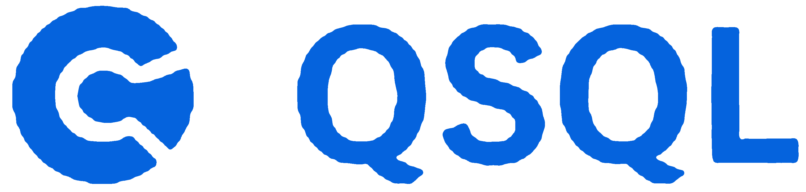
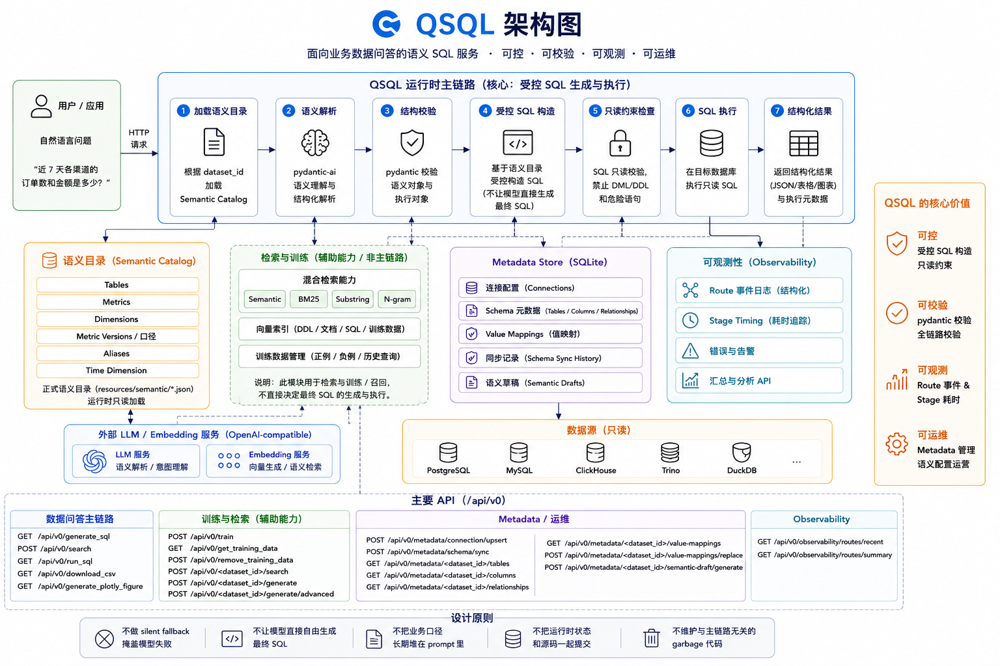
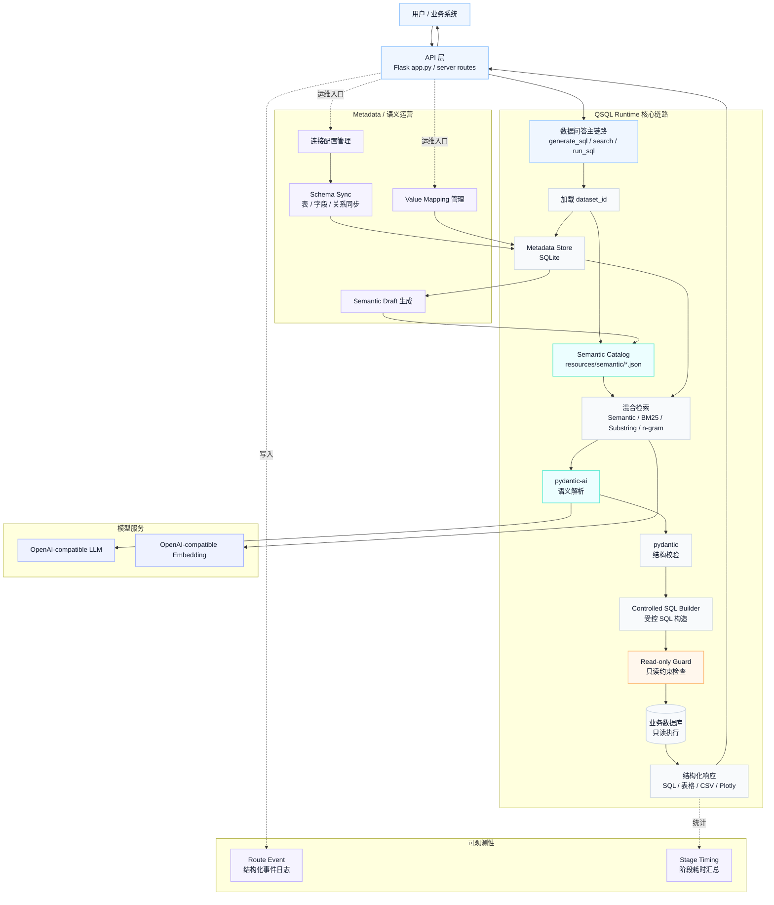
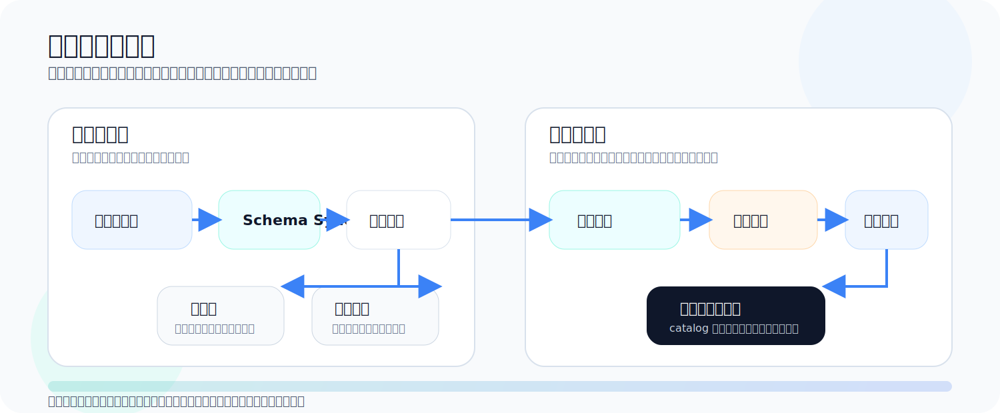

 

<p align="center">
  
</p>

QSQL 是一个面向业务数据问答的语义 SQL 服务。

它不走“LLM 直接自由生成 SQL”的路线，而是把链路收口为：

```text
question
-> semantic parse
-> pydantic validation
-> controlled SQL builder
-> read-only execution
-> structured response
```

QSQL 的核心目标是把数据问答做成一条 **可控、可校验、可观测、可运维** 的工程链路。

## QSQL 能做什么

QSQL 目前具备这几类能力：

- `pydantic + pydantic-ai` 驱动的语义解析与结构校验
- OpenAI-compatible LLM / embedding 接口
- 基于语义目录的受控 SQL 生成
- 只读 SQL 执行约束
- metadata store、schema sync、value mapping
- semantic draft 自动生成
- 混合检索能力
  - semantic
  - BM25
  - substring
  - n-gram
- route / stage timing 结构化埋点

## 核心运行时链路

<p align="center">
  
</p>

QSQL 的主链路是：

- 问题进入服务
- 加载 `dataset_id` 对应的 semantic catalog
- 用 `pydantic-ai` 解析结构化语义
- 用 `pydantic` 校验语义对象和执行对象
- 后端受控构造 SQL
- 执行前做只读约束
- 返回结构化结果

这条链路的重点不是“让模型多做事”，而是把模型放在合适的位置上：

- 模型负责理解问题
- 程序负责控制 SQL
- 语义目录负责承载业务结构
- metadata 和 observability 负责支撑运维



## 当前边界

这不是一个“任意复杂查询都能自动搞定”的项目，当前更适合：

- 单表或宽表的数据问答
- 结构化聚合查询
- 指标、维度、时间范围明确的业务分析

当前不把这些当作主目标：

- 任意多表自由 join
- 强开放式 SQL 生成
- 长文本条件推理型查询
- 无语义配置前提下的复杂企业口径分析

## 项目结构

```text
app.py                       Flask 入口
src/qsql/                    核心运行时
  semantic_service.py        语义编排
  sql_builder.py             受控 SQL 构造
  schemas.py                 Pydantic 模型
  metadata_store.py          metadata SQLite
  schema_sync.py             schema 同步
  observability.py           结构化事件日志
src/server/                  API 蓝图
resources/semantic/          正式语义目录
resources/semantic_drafts/   metadata 生成的语义草稿
tests/                       回归测试
```

## 快速开始

### 1. 安装

```bash
pip install -e .
```

如需可选数据库依赖：

```bash
pip install -e ".[all]"
```

### 2. 配置环境变量

最小 `.env` 示例：

```env
LLM_BASE_URL=http://127.0.0.1:8000/v1
LLM_MODEL=qwen2-7b-instruct
LLM_API_KEY=EMPTY

EMBEDDING_BASE_URL=http://127.0.0.1:3000/v1
EMBEDDING_MODEL=bge-m3
EMBEDDING_API_KEY=EMPTY

LLM_TEMPERATURE=0.7
N_RESULTS_DDL=10
N_RESULTS_SQL=10
N_RESULTS_DOCUMENTATION=10
QUESTION_SQL_MAX_DISTANCE=0.45
QUESTION_SQL_DISTANCE_FILTER_ENABLED=false
```

### 3. 启动服务

```bash
python app.py
```

默认会加载：

- `resources/semantic/<dataset_id>.json`
- 本地 metadata SQLite
- 本地结构化事件日志目录

## 语义目录

运行时正式读取：

- `resources/semantic/<dataset_id>.json`

示例数据集：

- `resources/semantic/sales.json`

语义目录详细格式说明见：

- [resources/semantic/README.md](/data/temp/qsql/resources/semantic/README.md:1)

## Metadata 能力



QSQL 不要求你手工从零维护所有语义对象，它已经提供一套 metadata 辅助链路：

- 数据库连接配置落库
- schema table / column / relationship 同步
- value mapping 独立管理
- metadata -> semantic draft 生成

这意味着你可以先同步物理 schema，再逐步把业务指标、别名、口径补成正式语义目录。

## 结构化运维能力

除了查询主链路，QSQL 还提供配套的运维能力：

- metadata 连接配置管理
- schema sync 执行记录
- value mapping 管理
- semantic draft 自动生成
- route 维度事件追踪
- stage timing 汇总查看

如果你要做的是长期维护的数据问答服务，这部分能力和主查询链路同样重要。

## 主要 API

### 数据问答主链路

- `GET /api/v0/generate_sql`
- `POST /api/v0/search`
- `GET /api/v0/run_sql`
- `GET /api/v0/download_csv`
- `GET /api/v0/generate_plotly_figure`

### 训练与检索

- `POST /api/v0/train`
- `GET /api/v0/get_training_data`
- `POST /api/v0/remove_training_data`
- `POST /dataset/<dataset_id>/search`
- `POST /dataset/<dataset_id>/generate`

### Metadata / 运维

- `POST /api/v0/metadata/connection/upsert`
- `POST /api/v0/metadata/schema/sync`
- `GET /api/v0/metadata/<dataset_id>/tables`
- `GET /api/v0/metadata/<dataset_id>/columns`
- `GET /api/v0/metadata/<dataset_id>/relationships`
- `GET /api/v0/metadata/<dataset_id>/value-mappings`
- `POST /api/v0/metadata/<dataset_id>/value-mappings/replace`
- `POST /api/v0/metadata/<dataset_id>/semantic-draft/generate`

### Observability

- `GET /api/v0/observability/routes/recent`
- `GET /api/v0/observability/routes/summary`

## 开发与验证

### 测试

```bash
python -m pytest tests/
```

### Lint

```bash
ruff check app.py src tests scripts
```

### 编译检查

```bash
python -m py_compile app.py $(find src -name '*.py' -print) $(find tests -name '*.py' -print) $(find scripts -name '*.py' -print)
```

## 设计原则

这个仓库当前遵守几条硬规则：

- 不做 silent fallback 掩盖模型失败
- 不让模型直接自由生成最终 SQL
- 不把业务口径长期堆在 prompt 里
- 不把运行时状态和源码一起提交
- 不继续维护和主链路无关的 provider / plugin / mock 垃圾面

## 适用场景

QSQL 适合这类场景：

- 企业内部数据问答
- 以宽表或主题数据集为中心的分析查询
- 需要业务口径和别名管理的指标问答
- 需要 route 观测、metadata 管理、语义配置运营的系统

## 当前项目形态

- 包名：`qsql`
- 运行时核心：`src/qsql`
- API 入口：`app.py`
- 语义目录入口：`resources/semantic`
- 主目标：业务数据问答的工程化落地

如果你需要的是：

- 一个可以继续扩业务指标和口径的骨架
- 一套可以落 metadata / semantic / observability 的基础设施
- 一条受控、结构化、可追踪的数据问答主链路

那这个仓库就是为这个目的准备的。
